*addCell* function example
--------------------------
Here is an example that puts the elements written in a list, into the open (empty or no) schematic.
`addCell('("gnd" "vdc" "vdd" "noConn" "vbit" "vpulse" "vsin"))`.
The library names can be specified with the fifth parameter list.
`addCell('("gnd" "noConn") t nil t '("analogLib"  "basic"))`

Personnal comment : this function is given for 'howto' puspose, i do not really use it generally. I prefer function array2sch, see below.


*freeLCK* function example
--------------------------
When a schematic view is opened in Read mode.
Remove existing lock that belongs to you (that you have the right to delete). Opened from a crashed session for instance. And it puts the schematic in the edit mode.


*array2sch* function example
--------------------------
Take, or generate for your needs, a list with the cellName and its input and output incremanted (or not) names. Then is creates an array of cells with net and labels on top in the opened schematic cellView. 
See [array2sch_tuto.il](./array2sch_tuto.il) example file.


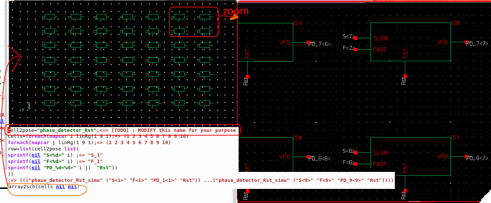


*schematic2symbol* function example
--------------------------
From an open schematic with pins, generate a rectangle symbol with the pins at the same location distance of the schematic.
For practical simplicity, i use named label to put pins in a nearby area.


*vdcGen* function example
--------------------------
From an open schematic, generates an array or a list of analogLib vdc with shifted verilog syntax bit, in order to use the parameter in a simulation (ADE, ADEXL, or whatever new maestro tool).

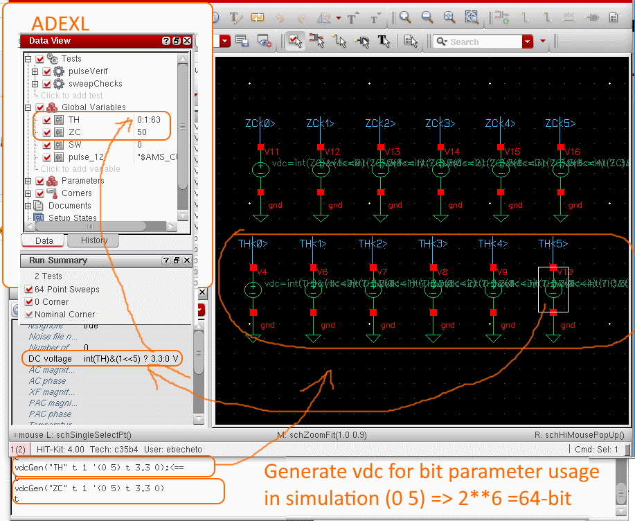


*menu* function example
--------------------------
Add a menu in CIW ( former icfb ), the pull down menus with the function a generally use.


*rexFindCell* function example
--------------------------
search in the libraries defined in the cds.lib where exist a pattern

rexFindCell("or" "CORELIB" t)	;<== search in the library CORELIB where there an 'or' with case insensitivity.

rexFindCell("^mos" )	   	;<== search everywhere a cell starting with 'mos'

;=>(("ahdlLib" "mos_tft") 
    ("ahdlLib" "mos_level1"));<== answer

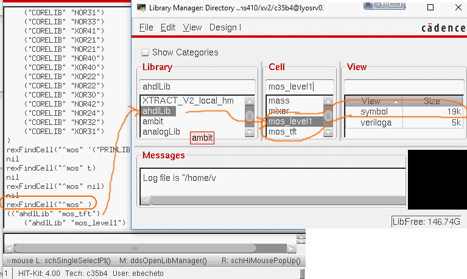


*whereIncludeCell* function example
--------------------------
When i don't remember where i have used a cell in my design, i search with : 'whereIncludeCell'. (Warning a bit long to search in all the libraries. 

whereIncludeCell( "ampli");<= search in all libs where i put my_amplifier or so.

;=> (("functional" "libContents" "amplifier") ...
 ("my_lib" "simu_mem_2cell" "hold_amplifier")) ;<= answer

whereIncludeCell( "inv_cor" "CORELIB");<== search where inv_core is used in the CORELIB

;=> (("CORELIB" "JKS3" "inv_core") ...) ;<== answers (...too many lines to print for this example)

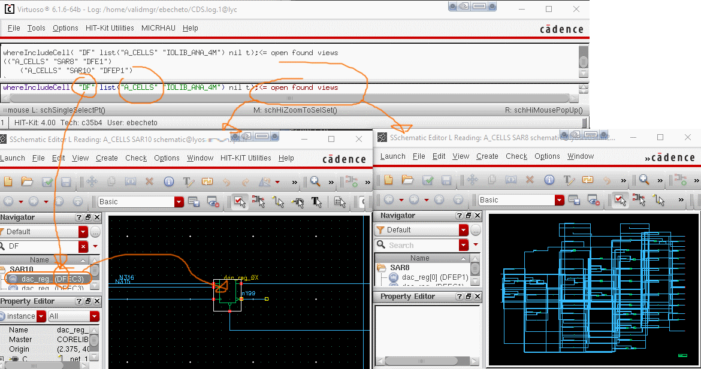


*prettyPrint* function example
--------------------------
print the postscript of the viewing cell, and convert it on the go with ghostscript, with a slightly wider pen size (setlinewidth=5 instead of 1). In order to havec better contrast of the lines.

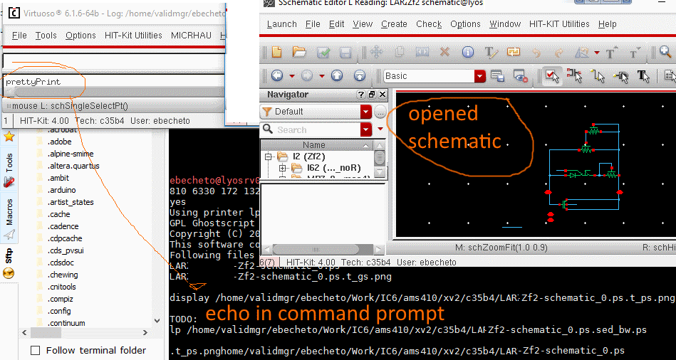

\_\_VV\_\_ See below an example of generated image view. Normally it's the best definition you could get for a presentation or a technical document. \_\_VV\_\_

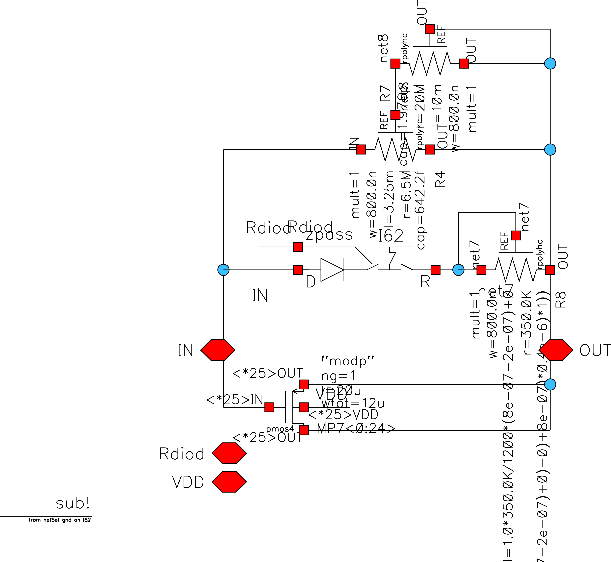


*updateCellviews* function example
--------------------------

When a copy was done without checking by mistake the button "[] Update Instances: Of new copies Only", or when a collegue send you a library but some cells are defined from another library, but a copy is present in the current library. Then this script goes and search if a cell is defined in the current cell and affect it to the instance (technically, its the master of the instance that is updated).


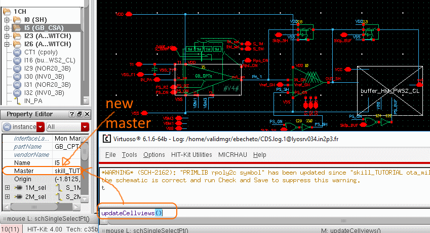
In the example, the buffer is not present in the library, so it cannot be updated. This function works also for Layout : updateCellviewsL(). But in Layout, there is a predefined function : Tools->remaster_Instances that does the job allready.


*mos2fet* function example
--------------------------
update a schematic with all the symbol to be modified. Could be looped easily on the entire library. Update net position except if the net does not touch the center of the pin.
could be used to translate a design to another techno.

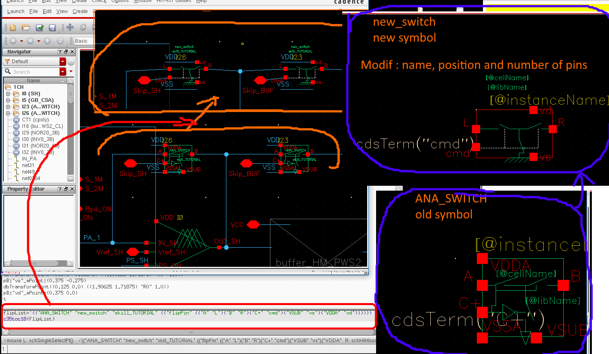
See [mos2fet_tuto.il](./mos2fet_tuto.il) example file.
The cell 'buffer_HM...' does not exist in the library, an so, is not updated.


*genBox* function example
--------------------------
From the core schematic level, it takes the pins in the existing cellview and generate a template file for the padRing function, and execute this template. It means that it generates schematic, symbol and layout pad rings with conner abuted with the default value. The template permits to adapt the size, and the space of the diod cells. This is functionnal off-the-shelf with AMS035 and IBM130 by default. Should be adapted with other technos. (change spacing metal name, IO lib names etc.) 
pinName list order start from bottom left and are posed one by one in the counter clockwise order.
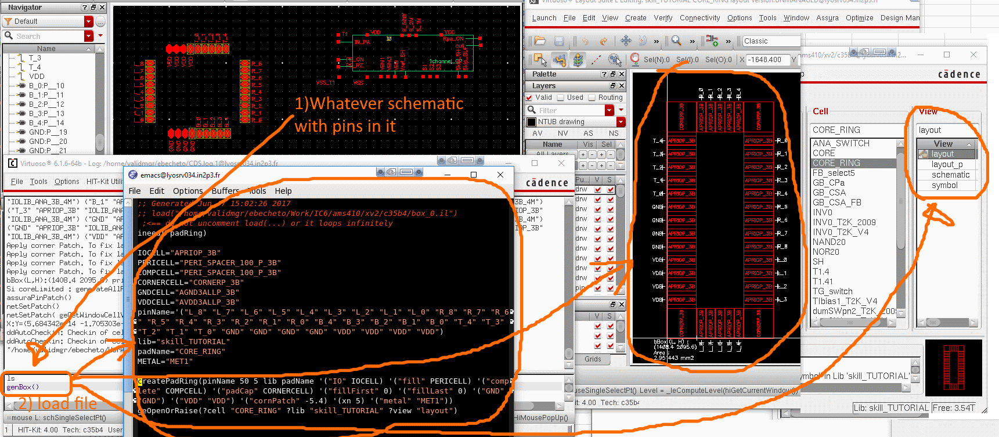
Here is another example. The parameter xn specifies the number of pad in X row. [omited=> square]. The first two optional number are for X and Y spacing between pads. It is usable if spacer cells exist with multiple size. A long time ago, i used to create a pCell spacer, so that i could stretch the spacer easily, but i gave up.
procedure(createPadRing( l_pins @optional (spaceL 5) (spaceH 5) (libname getEditRep()\~>libName) (cellname getEditRep()\~>cellName)  @rest rest)
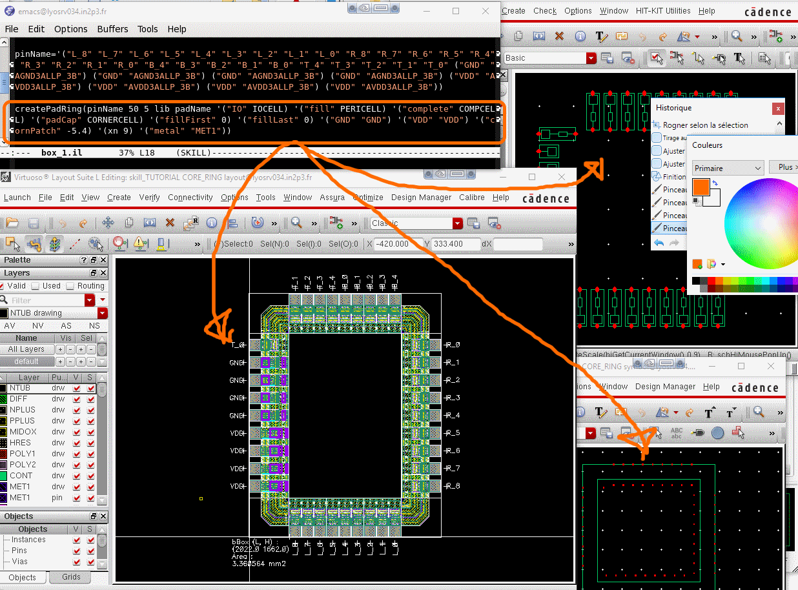


*generateAllPins* function example
--------------------------
When placing the instance manually in a layout, i generally don't want to place the pins manually. So the script loop on the pins of the schematic, and created the layout pin rectangle and label where the should be on the layout instance.
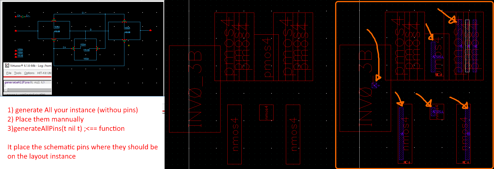


*emacs_ipcPipe.il* function example
-----------------------------------
When clicking one menu->emacs_ipcPipe, it creates a named pipe in /tmp/ipcPipe2CAT_$USER
Then a line in emacs in skillMode can be executed in virtuoso with a shortcut bindkey (C-c-f or C-c-v). The outputed result from virtuoso can be pasted back into emacs with bindkey C-c-s.
Possibly, it can be used by another external script. 
```
echo -e '1+1' >  ~/.emacs2icfb.il
echo 'loadEOF' > /tmp/ipcPipe2CAT_ebecheto 
```

&#x1F34E;
VERY VERY VERY HANDY
&#x1F34E;
I could not code anymore without this feature. I came-up with this solution inspired by gnuplot-mode.

```diff
- if you read until here you probaly learnt something.
```