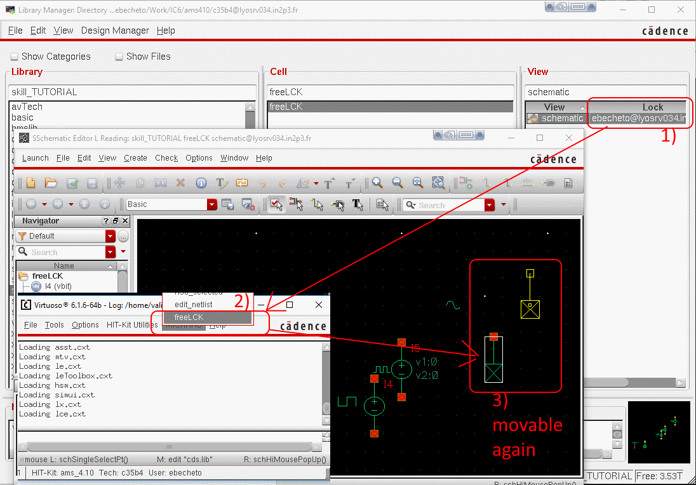

*addCell* function example
--------------------------
Here is an example that puts the element written in a list, into the open (empty or no) schematic.
`addCell('("gnd" "vdc" "vdd" "noConn" "vbit" "vpulse" "vsin"))`.
The library names can be specified with the fifth parameter list.
`addCell('("gnd" "noConn") t nil t '("analogLib"  "basic"))`

Personnal comment : this function is given for 'howto' puspose, i do not really use it generally. I prefer function array2sch, see below.

*freeLCK* function example
--------------------------
When a schematic view is opened in Read mode.
Remove existing lock that belongs to you (that you have the right to delete). Opened from a crashed session for instance. And it puts the schematic in the edit mode

*array2sch* function example
--------------------------
Take, or generate for your needs a list with the cellName and its input and output incremanted (or notà names. Then is creates an array of cells with net and labels on top in the opened schematic cellView.

<pre>
; array2sch tutorial USAGE
; semi-automatic schematic generate

;needed function load
ineed('(array2sch getPropList nthcdr2) t)
; array2sch('test) ;&lt;== uncomment the dummy example for instance

; cellName of the instance to generate
cell2pose="phase_detector_Rst_simu";&lt;== [TODO] : MODIFY this name for your purpose
; if you have one such cell on your schematic, select it and 
getPropList();=&gt;("phase_detector_Rst"  ("SLOW" "FAST" "VOUT" "vdd!" "gnd!"      "Rst"    ) nil)
; ne prendre que les premiers parametres
nthcdr2(0 2 getPropList() )
;=&gt; ("phase_detector_Rst" ("SLOW" "FAST" "VOUT" "vdd!" "gnd!" "Rst"))
; WARNING, in this example, the net vdd! and gnd! are global and should not be put in the parameter list.

; faire une matrice pour dire a la fonction array2sch ce qu'il faut generer.
cells=foreach(mapcar i linRg(1 9 1);=&gt; (1 2 3 4 5 6 7 8 9 10)
foreach(mapcar j linRg(1 9 1);=&gt; (1 2 3 4 5 6 7 8 9 10)
row=list(cell2pose list(
sprintf(nil "S&lt;%d&gt;" i) ;=&gt; "S_1"
sprintf(nil "F&lt;%d&gt;" i) ;=&gt; "F_1"
sprintf(nil "PD_%d&lt;%d&gt;" i j)  "Rst"))
))
;=&gt; ((("phase_detector_Rst_simu" ("S&lt;1&gt;" "F&lt;1&gt;" "PD_1&lt;1&gt;" "Rst")) ...("phase_detector_Rst_simu" ("S&lt;9&gt;" "F&lt;9&gt;" "PD_9&lt;9&gt;" "Rst"))))

;EXECUTION OF THE GENERATION FONCTION
array2sch(cells nil nil)
; OPTIONNAL =&gt; add input and output pins
PD_pins=foreach(mapcar i linRg(1 9 1) sprintf(nil "PD_%d&lt;1:9&gt;" i))
;=&gt; ("PD_1&lt;1:9&gt;" "PD_2&lt;1:9&gt;" "PD_3&lt;1:9&gt;" "PD_4&lt;1:9&gt;" "PD_5&lt;1:9&gt;" "PD_6&lt;1:9&gt;" "PD_7&lt;1:9&gt;" "PD_8&lt;1:9&gt;" "PD_9&lt;1:9&gt;")
ineed('terminalGen t)
terminalGen(reverse(PD_pins))
</pre>

